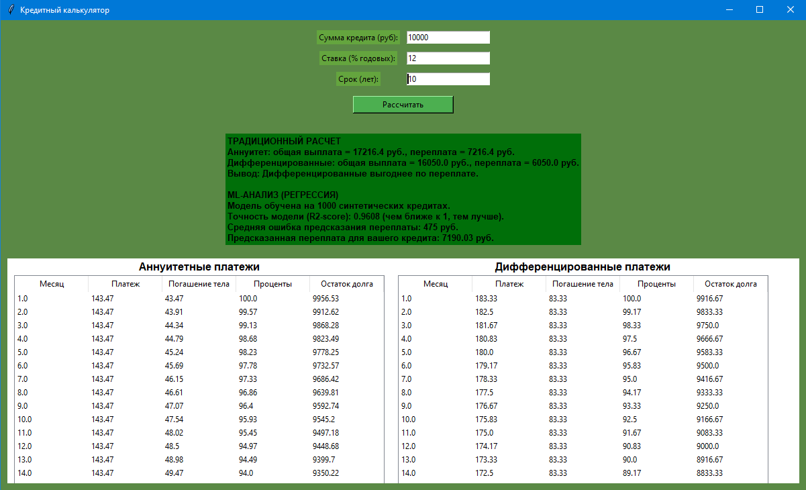

Кредитный калькулятор с ML-анализом (Pet-Project)  

Данный проект представляет собой десктопное приложение на Python (Tkinter), которое объединяет классический финансовый расчет кредитов и элементы машинного обучения для анализа переплаты.  

_Проблема, наталкнувшая на создание проекта:_  

Стандартные кредитные калькуляторы показывают только математический расчет по формулам. Для демонстрации навыков Data Science был добавлен модуль, который на основе введенных параметров генерирует синтетический датасет, обучает модель линейной регрессии и предсказывает переплату.

_Цели проекта:_
1. Практическая демонстрация навыков работы с библиотеками **Pandas, NumPy, Scikit-learn**.
2. Демонстрация полного цикла ML-задачи: генерация данных → обучение модели → оценка метрик.
3. Создание удобного GUI-интерфейса для взаимодействия с расчетами.

_Используемый стек технологий:_
- **Язык:** Python 3
- **GUI-библиотека:** Tkinter (для интерфейса)
- **Data Science:** Pandas, NumPy, Scikit-learn (LinearRegression)
- **Визуализация:** Matplotlib / Seaborn (для графиков платежей)

_Функционал приложения:_

_1. Классический финансовый модуль:_
- Поддержка двух типов платежей: **Аннуитетные** и **Дифференцированные**.
- Построение полного графика погашения кредита (таблица с разбивкой по месяцам: тело долга, проценты, остаток).
- Сравнение итоговой переплаты и выбор наиболее выгодного варианта.

_2. ML-модуль (анализ переплаты):_
- **Генерация синтетических данных:** На основе введенных пользователем параметров (сумма, ставка, срок) программа генерирует 1000 вариаций кредитов с добавлением случайного шума (имитация реального отклонения от формул).
- **Обучение модели:** Используется модель **LinearRegression** (линейная регрессия) из библиотеки Scikit-learn.
- **Метрики качества:** Выводятся метрики **R2-score** (коэффициент детерминации) и **MAE** (средняя абсолютная ошибка), чтобы показать, насколько точно модель умеет предсказывать переплату.
- **Бизнес-вывод:** Модель предсказывает ожидаемую переплату для конкретного введенного кредита.

